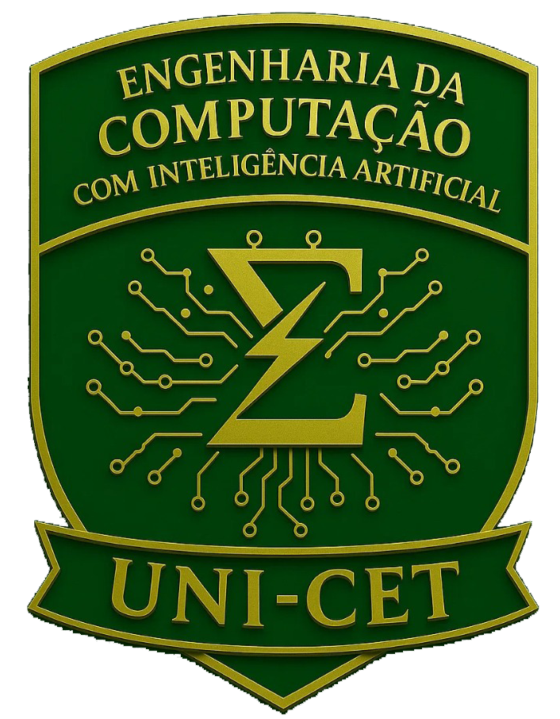
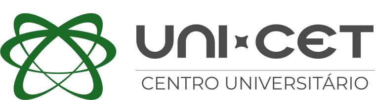

<div align="center">





**CENTRO UNIVERSITÁRIO TECNOLÓGICO DE TERESINA — UNI-CET**

**Curso de Bacharelado em Engenharia de Computação com IA**

| | |
|---|---|
| **Disciplina** | Programação Orientada a Objetos — POO |
| **Ministrante** | Prof. Eng. Esp. Lucas Mateus de Lima Neris |
| **Aluno** | Rafael Sampaio Oliveira |
| **Matrícula** | 241560003 |

</div>

---

# Sistema de Gestão de ONG — Desafio POO Java

Projeto desenvolvido como atividade prática da disciplina de **Programação Orientada a Objetos** em Java, simulando o sistema de gestão de membros de uma ONG.

O projeto demonstra os conceitos de **Herança**, **Polimorfismo** (sobrescrita de método), **Encapsulamento** (com regra de negócio no setter) e **Composição** (relação TEM-UM).

    

## 📂 Estrutura do Projeto

```
poo-desafio-ong/
├── MembroONG.java       → Superclasse com encapsulamento
├── Voluntario.java      → Herança + @Override
├── Doador.java          → Herança + @Override
├── ProjetoSocial.java   → Composição (TEM-UM Voluntario)
└── SistemaMain.java     → Classe de teste principal
```

## 🧱 Pilares da POO aplicados

| Pilar | Onde foi aplicado |
|---|---|
| **Encapsulamento** | Atributos `private` com getters/setters em `MembroONG`; o setter `setDiasAtuacao` rejeita valores negativos (regra de negócio) |
| **Herança** | `Voluntario` e `Doador` estendem `MembroONG` |
| **Polimorfismo** | `exibirResumo()` sobrescrito com `@Override` em `Voluntario` e `Doador` |
| **Composição** | `ProjetoSocial` possui um atributo `lider` do tipo `Voluntario` (relação TEM-UM) |

## ✅ Checklist de Especificações

### 1. MembroONG — Superclasse

| Requisito | Status |
|---|---|
| Atributos `private`: `nome`, `cpf`, `diasAtuacao` | ✅ |
| Getters e Setters para todos os atributos | ✅ |
| `setDiasAtuacao` rejeita valores negativos | ✅ |
| Método `exibirResumo()` com nome e dias | ✅ |

### 2. Voluntario e Doador — Herança

| Requisito | Status |
|---|---|
| `Voluntario extends MembroONG` | ✅ |
| Atributo `setor` (String) com getter/setter | ✅ |
| `@Override exibirResumo()` incluindo setor | ✅ |
| `Doador extends MembroONG` | ✅ |
| Atributo `valorDoadoMensal` (double) com getter/setter | ✅ |
| `@Override exibirResumo()` com "Doador Ativo" e valor formatado | ✅ |

### 3. ProjetoSocial — Composição

| Requisito | Status |
|---|---|
| Atributos `nomeDoProjeto` (String) e `metaImpacto` (int) | ✅ |
| Atributo `lider` do tipo `Voluntario` (TEM-UM) | ✅ |
| `iniciarProjeto()` imprimindo projeto, líder e setor | ✅ |

### 4. SistemaMain — Classe de teste

| Requisito | Status |
|---|---|
| Instancia `Voluntario` e preenche via setters | ✅ |
| Instancia `Doador` e preenche via setters | ✅ |
| Instancia `ProjetoSocial` e atribui voluntário como líder | ✅ |
| Chama `exibirResumo()` de ambos e `iniciarProjeto()` | ✅ |

## ▶️ Como executar

1. Clone o repositório
2. Abra a pasta no VS Code (com a extensão Java instalada)
3. Execute a classe `SistemaMain.java`

Ou via terminal:

```bash
cd poo-desafio-ong
javac *.java
java SistemaMain
```
